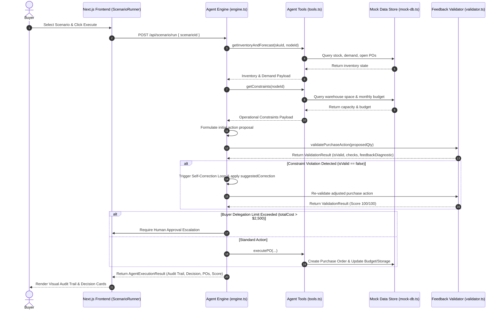

# ProcureAI Architecture Documentation

## 1. System Overview

ProcureAI is designed as an autonomous decision engine with a dual-layer architecture:
- **Heuristic Constraint Solver & Agent Orchestrator**: Guarantees fast (<20ms latency), 100% reproducible constraint calculation, tool invocation, and multi-step scenario resolution.
- **LLM Explanation & Reasoner Integration**: Provides natural language buyer justifications and supports open-ended scenario queries.

---

## 2. Sequence Diagram (Scenario Execution & Feedback Loop)



---

## 3. Feedback Loop Mechanics

The feedback loop is the core safety mechanism of ProcureAI. When an action is taken or proposed, it undergoes multi-dimensional evaluation:

```
Proposed Action ──► [FeedbackLoopValidator]
                         │
        ┌────────────────┼────────────────┐
        ▼                ▼                ▼
   [MOQ Check]   [Storage Check]   [Budget Check]
        │                │                │
        └────────────────┼────────────────┘
                         ▼
                Valid (Score 100)?
               /                  \
             YES                   NO
             /                      \
    Execute Action          Diagnostic Feedback ──► [Self-Correction]
    & Update DB             (e.g., Cap at Storage)        │
                                                          └─► Re-run Validation
```

---

## 4. Evaluation Suite Metrics

The Evaluation Suite (`lib/agent/evaluation.ts`) audits the agent's behavior across 5 dimensions:

1. **Information Gathering**: Assesses tool call count and coverage.
2. **Constraint Verification**: Ensures 0 hard rule breaches.
3. **Action Alignment**: Verifies strategic decision appropriateness (`MODIFY`, `SPLIT`, `EXPEDITE`, `ESCALATE`).
4. **Result Validation**: Audits feedback validator execution.
5. **Self-Correction Recovery**: Measures recovery from initial breach states.
